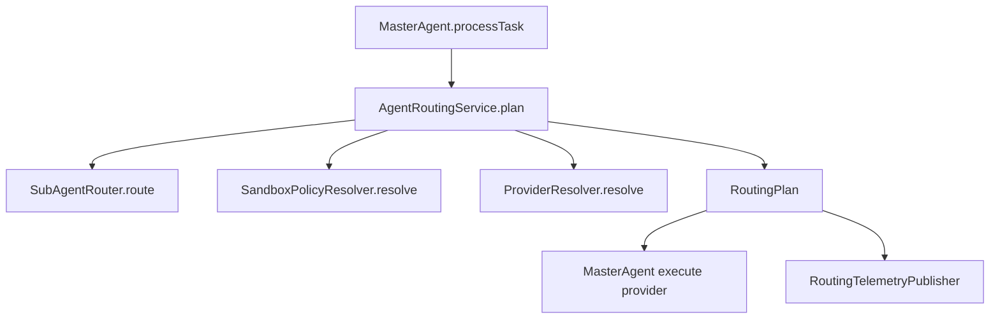

# T18-4 路由整併設計稿（Single Routing Source of Truth）

更新日期：2026-02-22

## 1) 問題陳述
目前路由決策分散在三處：
- `MasterAgent`：sub-agent 路由 + 執行上下文組裝。
- `SubAgentRouter`：語意 + 關鍵字混合路由。
- `UnifiedAgentRegistry`：sandbox/provider 路由。

風險：
- 決策來源分散，後續擴充容易出現策略不一致。
- 觀測資料難以集中（缺單一決策事件）。

## 2) 目標
- 建立單一路由入口 `AgentRoutingService`（暫定名）。
- `MasterAgent` 只負責流程編排，不直接處理多段路由細節。
- 路由結果輸出統一結構 `RoutingPlan`，供 provider 與 observability 共用。

## 3) 目標架構

## 4) 核心資料結構

`RoutingPlan`（建議欄位）：
- `taskId`
- `selectedSubAgentName`
- `selectedSubAgentRefPath`
- `fallbackUsed`
- `sandboxEnabled`
- `sandboxType`
- `providerName`
- `reason`
- `scores`（keyword/semantic/final）

## 5) 實作步驟
1. 新增 `AgentRoutingService`：集中組合 sub-agent、sandbox、provider 決策。
2. `MasterAgent` 改為呼叫 `AgentRoutingService.plan(...)`。
3. `UnifiedAgentRegistry` 僅保留 provider 選擇，不再承擔跨層決策語意。
4. 新增路由決策事件（後續供 T18-7 指標化）。
5. 補測試：
   - 無 descriptor fallback
   - sandbox=true 強制 sandbox provider
   - provider 不支援時錯誤分類

## 6) 非目標（本階段不做）
- A2A 路由。
- 多租戶路由策略 DSL。

## 7) 驗收條件
- `MasterAgent` 內不再同時存在「sub-agent + sandbox + provider」多段決策。
- 路由決策可由單一物件 `RoutingPlan` 重建。
- 關鍵路由分支有單元測試覆蓋。
