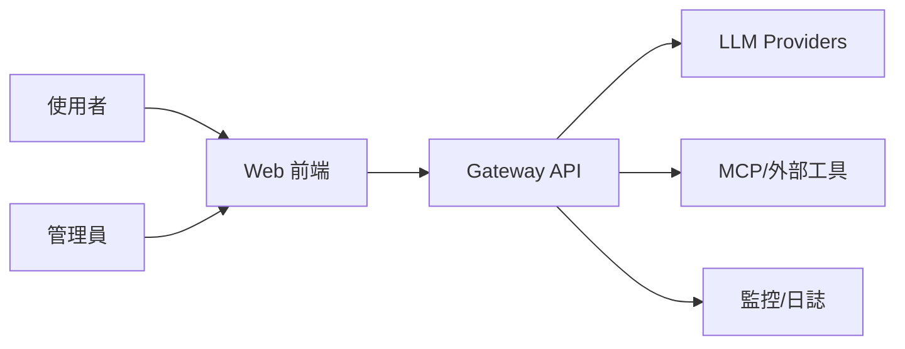
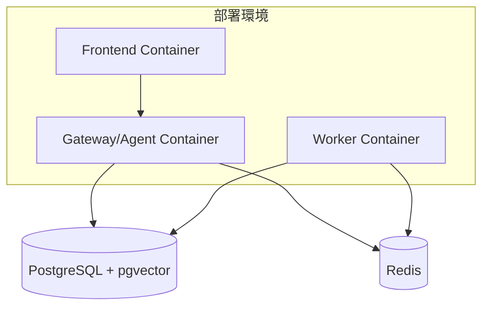
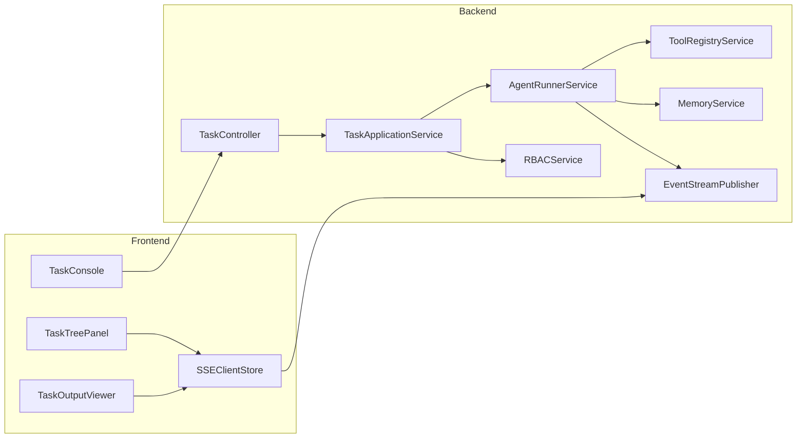
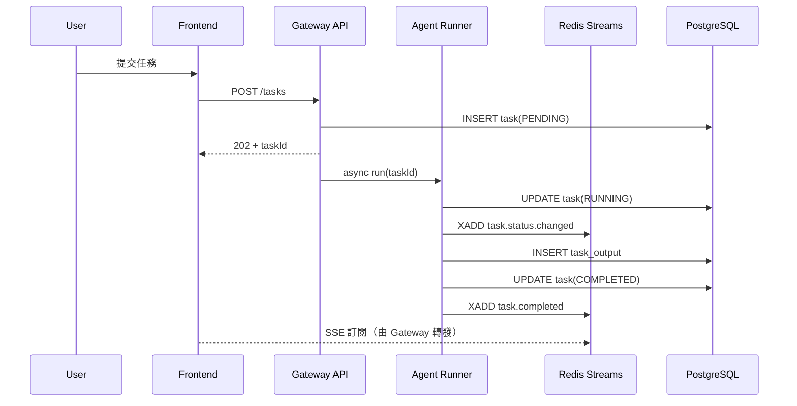
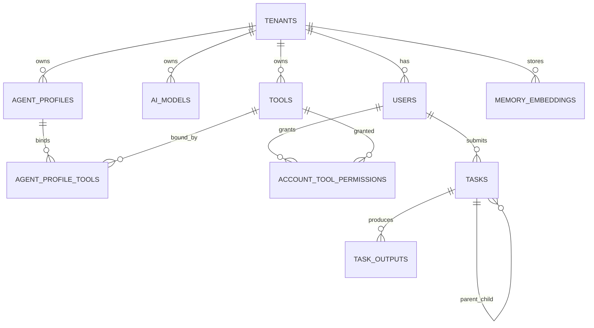
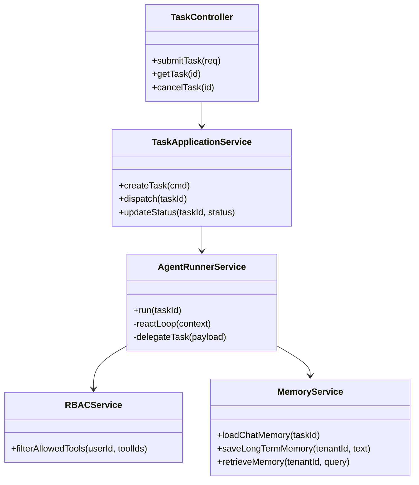
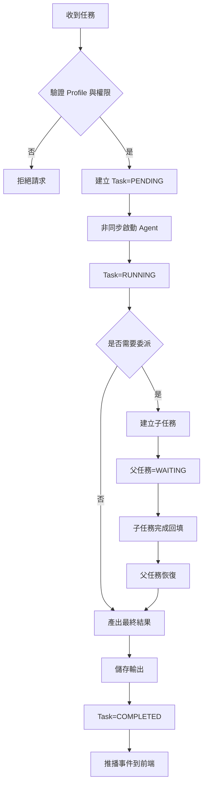
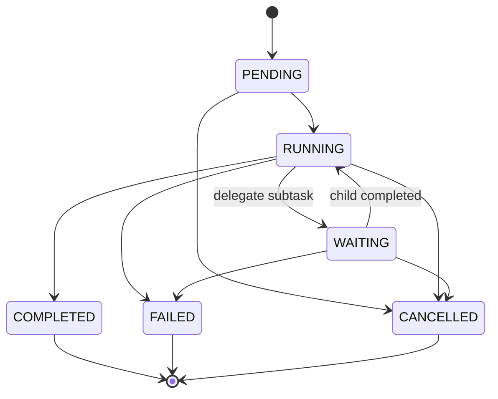

# TeamWork 系統規格書（spec）

## 1. 架構與選型
- 後端：Spring Boot 4.x (4.0.3) + Java 21（Virtual Threads）
- AI：Spring AI 2.0.0-M2（多模型抽象、Tool Calling）
- 資料庫：PostgreSQL（交易資料）+ pgvector（長期記憶）
- 快取/事件：Redis（Chat Memory、Redis Streams）
- 前端：React + TypeScript + Tailwind + React Flow
- 目標：多租戶、多 Agent 協作、可觀測、可擴充

選型理由：
- PostgreSQL + pgvector 可同時支撐結構化狀態與語意檢索
- Redis Streams 支援事件可回放，避免 Pub/Sub 遺失問題
- Spring AI 可抽象不同 LLM provider，降低供應商耦合

## 2. 資料模型
核心實體：
- `tenants`：租戶
- `users`：使用者
- `ai_models`：模型註冊
- `tools`：工具註冊
- `agent_profiles`：Agent 設定檔
- `agent_profile_tools`：Profile 與 Tool 關聯
- `account_tool_permissions`：使用者/租戶工具授權
- `tasks`：任務主體（含父子任務）
- `task_outputs`：任務輸出
- `memory_embeddings`：長期記憶向量
- `events_outbox`：事件外送佇列（可選，強化可靠性）

狀態機（`tasks.status`）：
- `PENDING`、`RUNNING`、`WAITING`、`COMPLETED`、`FAILED`、`CANCELLED`

## 3. 關鍵流程
1. 使用者送出任務（`POST /api/v1/tasks`）
2. Gateway 驗證租戶/使用者/Agent Profile
3. 建立 `tasks`（`PENDING`）並派發到 Agent Runner
4. Agent 執行 ReAct，讀寫 Redis Chat Memory
5. 若委派子任務，建立子 `tasks`，父任務轉 `WAITING`
6. 任務完成後寫入 `task_outputs`，發布事件到 Redis Streams
7. SSE 推播任務狀態與輸出摘要給前端

## 4. 虛擬碼
```text
function submitTask(request, user):
  assert authorized(user, request.profileId)
  profile = loadProfile(request.profileId, user.tenantId)
  model = loadModel(profile.defaultModelId, user.tenantId)
  tools = filterToolsByRBAC(profile.tools, user)

  task = createTask(
    tenantId=user.tenantId,
    userId=user.userId,
    parentTaskId=request.parentTaskId,
    status=PENDING,
    input=request.input
  )

  dispatchAsync(task.id, profile, model, tools)
  return { taskId: task.id, status: PENDING }

function runTask(taskId):
  updateTaskStatus(taskId, RUNNING)
  context = memory.load(taskId)
  result = reactLoop(taskId, context)

  if result.needDelegate:
    child = createChildTask(taskId, result.delegatePayload)
    updateTaskStatus(taskId, WAITING)
    waitChildAndResume(taskId, child.id)

  saveOutput(taskId, result.output)
  publishStreamEvent(taskId, COMPLETED)
  updateTaskStatus(taskId, COMPLETED)
```

## 5. 系統脈絡圖


## 6. 容器/部署概觀


## 7. 模組關係圖（Backend / Frontend）


## 8. 序列圖


## 9. ER 圖


## 10. 類別圖（後端關鍵類別）


## 11. 流程圖


## 12. 狀態圖


## 補充決策
- 事件通道統一：內部事件以 Redis Streams 為主；前端推播先以 SSE 為主（保留 WebSocket 擴充點）
- 多租戶隔離：所有核心資料表與 Redis Key 必含 `tenant_id`
- `InstallSkill` 先採人工審核上架，MVP 不做完全自動安裝
