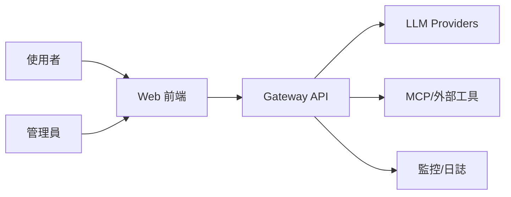
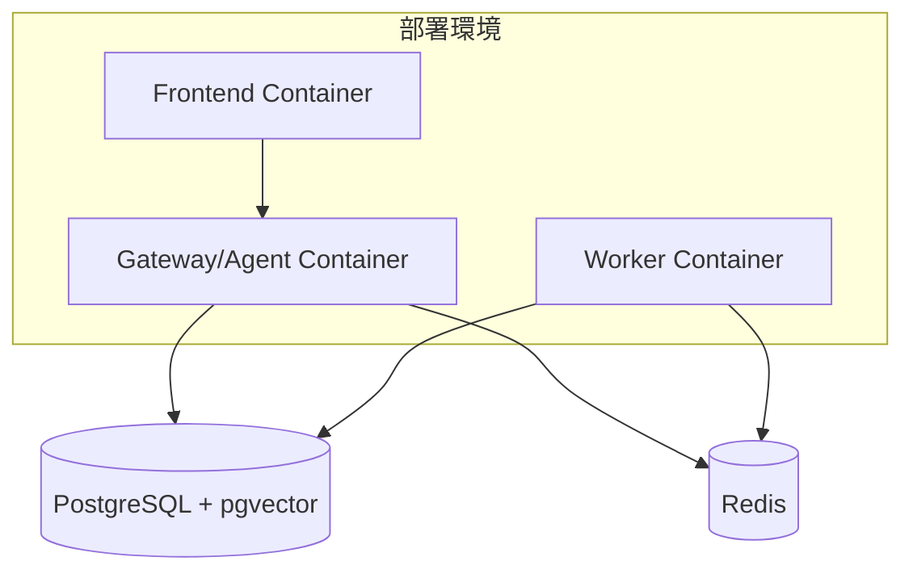
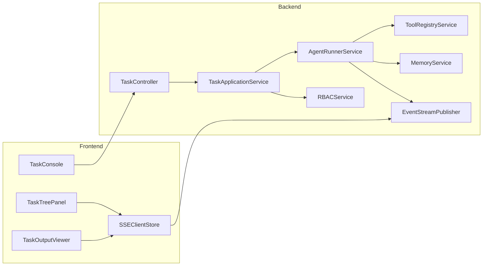
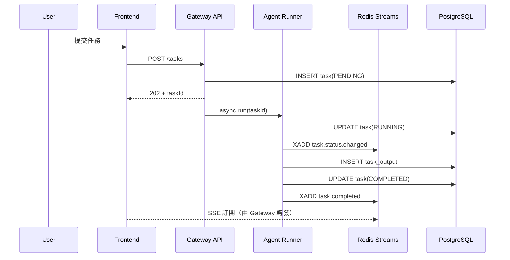
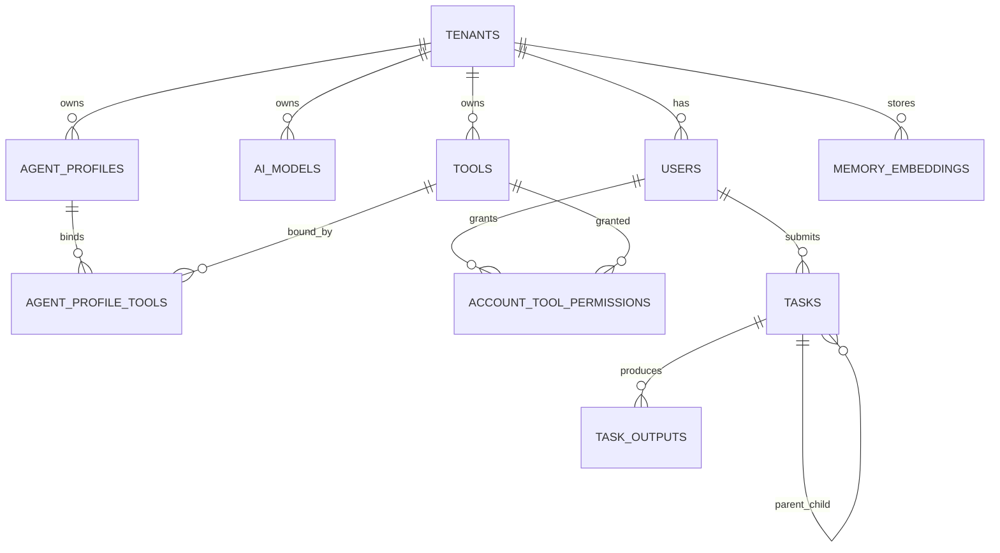
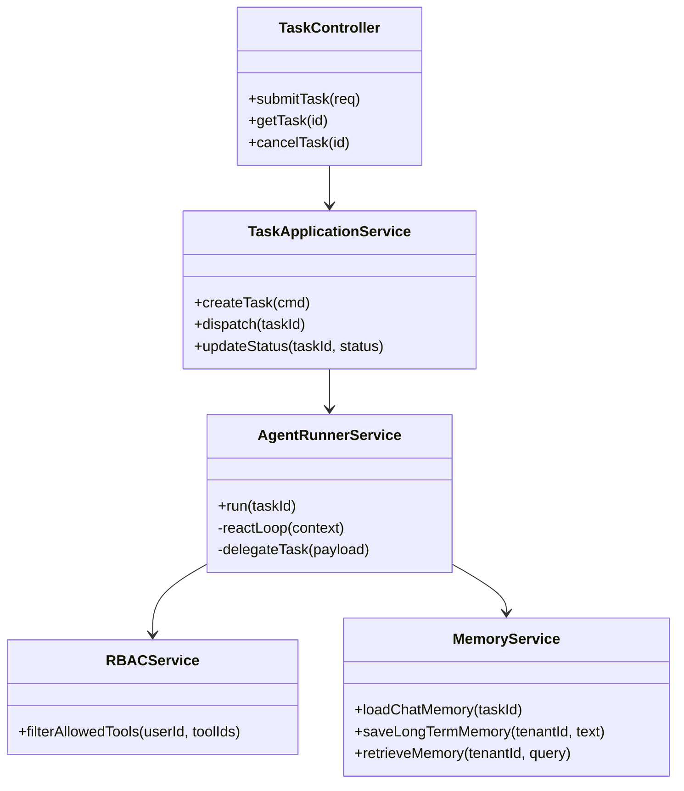
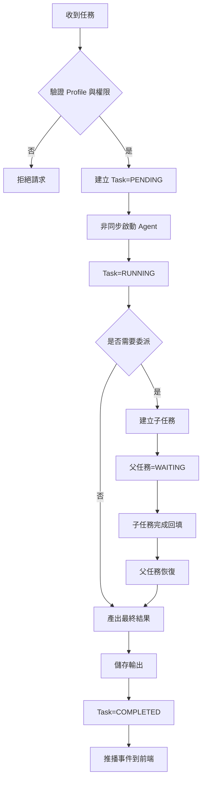
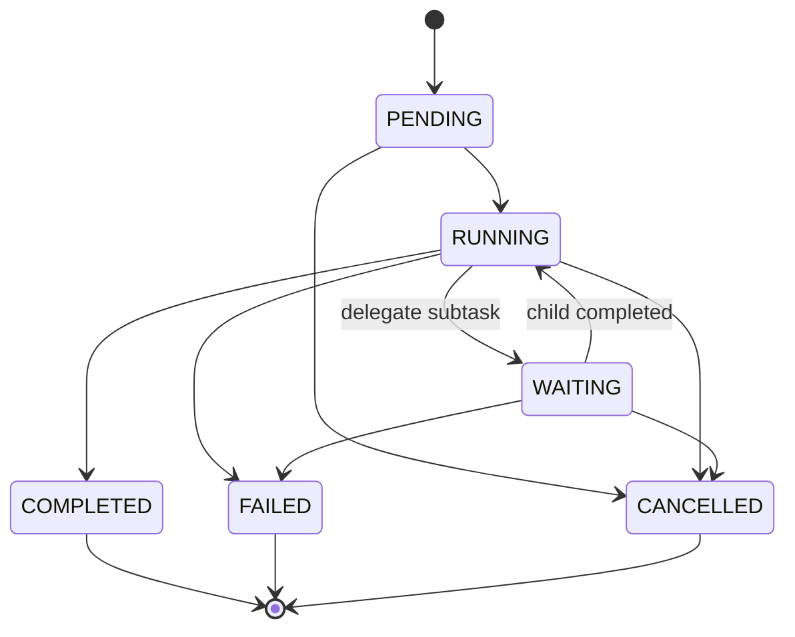

# TeamWork 系統規格書（spec）

## 1. 架構與選型
- 後端：Spring Boot 4.x (4.0.3) + Java 21（Virtual Threads）
- AI：Spring AI 2.0.0-M2（多模型抽象、Tool Calling）
- 資料庫：PostgreSQL（交易資料）+ pgvector（長期記憶）
- 快取/事件：Redis（Chat Memory、Redis Streams）
- 前端：React + TypeScript + Tailwind + React Flow
- 目標：多租戶、多 Agent 協作、可觀測、可擴充

選型理由：
- PostgreSQL + pgvector 可同時支撐結構化狀態與語意檢索
- Redis Streams 支援事件可回放，避免 Pub/Sub 遺失問題
- Spring AI 可抽象不同 LLM provider，降低供應商耦合

## 2. 資料模型
核心實體：
- `tenants`：租戶
- `users`：使用者
- `ai_models`：模型註冊
- `tools`：工具註冊
- `agent_profiles`：Agent 設定檔
- `agent_profile_tools`：Profile 與 Tool 關聯
- `account_tool_permissions`：使用者/租戶工具授權
- `tasks`：任務主體（含父子任務）
- `task_outputs`：任務輸出
- `memory_embeddings`：長期記憶向量
- `events_outbox`：事件外送佇列（可選，強化可靠性）

`users` 實體規劃（Phase 1 新增）：
- 欄位：`id`、`tenant_id`、`username`、`display_name`、`status`、`created_at`、`updated_at`
- 約束：`tenant_id + username` 唯一、`status` 僅允許 `ACTIVE`/`DISABLED`
- 用途：作為 Gateway 任務建立流程的使用者存在性驗證來源
- 邊界：僅保存使用者投影資料，不保存密碼雜湊、MFA secret、OAuth refresh token

狀態機（`tasks.status`）：
- `PENDING`、`RUNNING`、`WAITING`、`COMPLETED`、`FAILED`、`CANCELLED`

## 3. 關鍵流程
1. 使用者送出任務（`POST /api/v1/tasks`）
2. Gateway 驗證租戶/使用者/Agent Profile
3. 建立 `tasks`（`PENDING`）並派發到 Agent Runner
4. Agent 執行 ReAct，讀寫 Redis Chat Memory
5. 若委派子任務，建立子 `tasks`，父任務轉 `WAITING`
6. 任務完成後寫入 `task_outputs`，發布事件到 Redis Streams
7. SSE 推播任務狀態與輸出摘要給前端

排程治理補充（T20）：
- 排程來源支援 `SCHEDULE` / `WEBHOOK`，共用同一執行與審計主流程
- 排程目標支援 `AGENT` / `TOOL` / `SKILL`，統一錯誤分類（VALIDATION/CONFIGURATION/TIMEOUT/RUNTIME/INTERNAL）
- 共享上下文模式（`SHARED`）會依 `contextSegmentKey=targetType:targetRefId` lazy-load 前次快照
- 共享上下文套用保留與壓縮策略：`contextRetentionRuns`、`contextMaxTokens`
- 觀測面提供 `schedule.triggered/completed/failed` 事件計數與平均耗時快照

Task 建立請求驗證規則：
- `userId` 必填
- `profileId` 必填
- `inputPayload` 必填
- `userId` 必須存在於 `users` 且 `status=ACTIVE`
- 身分來源策略：`dev/test` 允許 request body `userId`；`prod` 禁用 request body `userId`，需改由 Token claims 提供
- 測試預設種子使用者：`u_alice`、`u_bob`

## 4. 虛擬碼
```text
function submitTask(request, user):
  assert authorized(user, request.profileId)
  profile = loadProfile(request.profileId, user.tenantId)
  model = loadModel(profile.defaultModelId, user.tenantId)
  tools = filterToolsByRBAC(profile.tools, user)

  task = createTask(
    tenantId=user.tenantId,
    userId=user.userId,
    parentTaskId=request.parentTaskId,
    status=PENDING,
    input=request.inputPayload
  )

  dispatchAsync(task.id, profile, model, tools)
  return { taskId: task.id, status: PENDING }

function runTask(taskId):
  updateTaskStatus(taskId, RUNNING)
  context = memory.load(taskId)
  result = reactLoop(taskId, context)

  if result.needDelegate:
    child = createChildTask(taskId, result.delegatePayload)
    updateTaskStatus(taskId, WAITING)
    waitChildAndResume(taskId, child.id)

  saveOutput(taskId, result.output)
  publishStreamEvent(taskId, COMPLETED)
  updateTaskStatus(taskId, COMPLETED)
```

## 5. 系統脈絡圖


## 6. 容器/部署概觀


## 7. 模組關係圖（Backend / Frontend）


## 8. 序列圖


## 9. ER 圖


## 10. 類別圖（後端關鍵類別）


## 11. 流程圖


## 12. 狀態圖


  ## 13. 上下文治理與壓縮（T19）

  ### 13.1 目標
  - UI 必須可觀測每個 Agent/Sub-Agent 的上下文使用量（token 與訊息數）。
  - 系統預設啟用「自動壓縮上下文」，並可設定壓縮閾值。
  - UI 必須可檢視完整上下文內容，並支援人工刪除不需要的上下文片段。

  ### 13.2 功能需求（MVP）
  1. **上下文用量看板**
    - 顯示欄位：`agentName`、`conversationId(taskId)`、`messageCount`、`estimatedTokens`、`compressionCount`、`lastUpdatedAt`。
    - 支援按 Agent、Task 狀態（RUNNING/WAITING/COMPLETED/FAILED）過濾。
  2. **自動壓縮（預設啟用）**
    - 預設值：`enabled=true`、`thresholdTokens=12000`、`targetTokens=6000`。
    - 當上下文估算 token 超過閾值，觸發壓縮工作流：
      1) 抽取不可遺失事實（需求、決策、約束、待辦、錯誤）
      2) 生成結構化摘要（替換舊歷史）
      3) 保留最近 N 則原文訊息（預設 N=8）
  3. **完整上下文檢視**
    - 可查看原始訊息、壓縮摘要、系統提示詞、工具呼叫記錄（名稱/參數/結果摘要）。
  4. **手動移除上下文**
    - 支援刪除單筆訊息、區間訊息、整段壓縮摘要。
    - 所有刪除行為需寫入審計紀錄（操作者、時間、刪除範圍、理由）。

  ### 13.3 壓縮提示詞策略（若專案尚無內建）
  建議採雙階段提示詞（對齊 prompt engineering「明確指令 + 結構化輸出 + 分段處理」）：

  **Stage A：萃取不可遺失資訊**
  ```text
  你是 Context Compressor。請從以下對話抽取「不可遺失資訊」，輸出 JSON：
  {
    "facts": [],
    "decisions": [],
    "constraints": [],
    "open_questions": [],
    "errors_and_fixes": [],
    "pending_todos": []
  }
  規則：
  1) 僅保留可影響後續執行的資訊。
  2) 不可杜撰；不確定則標記 "unknown"。
  3) 每項最多 1~2 行，保留關鍵 ID/檔名/參數。
  ```

  **Stage B：生成可回放摘要（覆蓋舊歷史）**
  ```text
  根據抽取結果，產生「可供代理人續跑」的上下文摘要，格式：
  1. 目標與範圍
  2. 已完成
  3. 進行中
  4. 風險與限制
  5. 下一步

  規則：
  - 控制在 {target_tokens} 內。
  - 優先保留 taskId/profileId/agentName/toolName 等識別資訊。
  - 以繁體中文輸出。
  ```

  ### 13.4 非功能需求
  - 壓縮流程需可觀測：觸發次數、壓縮前後 token、節省比例、失敗率。
  - 壓縮不得破壞任務一致性：`WAITING_USER_INPUT` 與 pending question 必須保留。
  - 壓縮策略需支援租戶級覆寫（tenant-level policy）。

  ## 14. 排程治理與任務編排（T20）

  ### 14.1 目標
  - 支援使用者「自行設定與調整」排程（建立、更新、啟用/停用、立即執行、刪除）。
  - 支援同租戶下「多個排程」並行運作。
  - 每個排程可明確指定執行目標：`AGENT`、`TOOL`、`SKILL`。

  ### 14.2 功能需求（MVP）
  0. **任務觸發抽象（Trigger Abstraction）**
    - 統一觸發模型：`triggerSource=SCHEDULE|WEBHOOK|MANUAL`。
    - 任務建立與執行流程共用同一套 trigger contract，避免排程與 webhook 分岔實作。
    - 舊系統整合採單向模式：外部系統僅送入事件並取得受理確認，不等待 Agent 最終執行結果。
    - 受理層僅保證 ack，執行結果由平台內部查詢/事件機制提供，避免反向耦合舊系統交易流程。
  1. **排程型態**
    - 支援 `CRON` 與 `INTERVAL` 兩種排程模式。
    - `CRON` 使用標準 cron expression（可指定時區）。
    - `INTERVAL` 以秒為單位（最小 60 秒，避免過度觸發）。
  2. **多排程管理**
    - 同一租戶可建立多筆排程。
    - 排程需具備 `priority` 與 `maxConcurrentRuns`，避免資源爭用。
  3. **指定執行目標**
    - `targetType=AGENT`：指定 `agentProfileId`，由統一 provider 流程執行。
    - `targetType=TOOL`：指定 `toolId` 與輸入參數，直接觸發工具。
    - `targetType=SKILL`：指定 `skillId` 與上下文，透過 skills 流程執行。
  4. **共用上下文（Shared Schedule Context）**
    - 排程可設定 `contextMode`：`ISOLATED`（預設，互不共享）或 `SHARED`（共用同一 schedule context）。
    - 當 `contextMode=SHARED`，本次執行可讀取同一 `scheduleId` 的前次摘要、工具輸出摘要、關鍵決策與待辦。
    - 共享上下文採 **啟動時 lazy-load**：僅在 run 啟動點由資料庫取回，不做預載。
    - 需以 `contextSegmentKey=targetType:targetRefId` 做任務與上下文段映射，避免不同目標互相污染。
    - 可設定 `contextRetentionRuns`（保留最近 N 次執行上下文，預設 20）與 `contextMaxTokens`（超過即自動壓縮）。
  4. **動態調整能力**
    - 排程可在不中斷服務情況下調整 `cron/interval/timezone/payload/target`。
    - 變更後必須即時生效（重新註冊 trigger）。
  5. **執行與追蹤**
    - 每次觸發建立 `schedule_runs` 記錄，含狀態、開始/結束時間、耗時、錯誤摘要。
    - 支援手動「立即執行一次（run once now）」與「重試最後一次失敗」。
  6. **Webhook 觸發**
    - 提供 webhook 端點觸發任務，並可指定綁定目標（Agent/Tool/Skill）。
    - 需支援簽章驗證（HMAC）與重放防護（timestamp + nonce + idempotency key）。
    - 簽章演算法採 `HmacSHA256`，canonical string 統一為：`timestamp + "\\n" + nonce + "\\n" + webhookKey + "\\n" + inputPayload + "\\n" + idempotencyKey`。
    - 預設時間窗為 300 秒；超出時間窗視為無效請求。
    - nonce 需以 TTL 快取去重（預設 TTL 300 秒），同 nonce 不可重複受理。
    - webhook 觸發後寫入 `schedule_runs`（`trigger_type=WEBHOOK`）或對應 trigger run 紀錄。
    - webhook 只回覆受理狀態（`202 Accepted`），不在同一請求中回傳 Agent 最終處理內容。

  ### 14.3 資料模型（新增）
  - `task_schedules`
    - 欄位：`id`、`tenant_id`、`name`、`enabled`、`schedule_type`、`cron_expr`、`interval_seconds`、`timezone`、`target_type`、`target_ref_id`、`payload_json`、`priority`、`max_concurrent_runs`、`context_mode`、`context_retention_runs`、`context_max_tokens`、`next_run_at`、`created_by`、`created_at`、`updated_at`
  - `schedule_runs`
    - 欄位：`id`、`schedule_id`、`tenant_id`、`trigger_type`（AUTO/MANUAL/RETRY/WEBHOOK）、`status`（PENDING/RUNNING/SUCCESS/FAILED/CANCELLED）、`started_at`、`finished_at`、`duration_ms`、`result_summary`、`error_code`、`error_message`
  - `task_triggers`
    - 欄位：`id`、`tenant_id`、`name`、`trigger_source`（SCHEDULE/WEBHOOK/MANUAL）、`target_type`、`target_ref_id`、`enabled`、`secret_ref`、`idempotency_ttl_seconds`、`created_at`、`updated_at`
  - `schedule_context_snapshots`
    - 欄位：`id`、`schedule_id`、`run_id`、`task_id`、`context_segment_key`、`tenant_id`、`message_count`、`estimated_tokens`、`context_summary`、`tool_result_summary`、`pending_todos`、`created_at`

  ### 14.4 非功能需求
  - 排程需具備冪等保護（同一觸發視窗不可重複執行）。
  - 排程執行失敗需支援退避重試（exponential backoff）與最大重試次數。
  - 所有排程操作與執行結果需有審計軌跡（操作者、時間、變更內容）。
  - 需輸出觀測指標：排程數、觸發次數、成功率、失敗率、平均耗時、併發占用。

  ## 15. 通知編排與派送（T21）

  ### 15.1 目標
  - 系統需支援任務通知能力：Email 與社群軟體通知（如 Slack/Discord/LINE/Teams/Webhook）。
  - 使用者在建立排程或 webhook trigger 時，可選擇通知通道與通知時機。
  - 通知需可配置成功/失敗/完成摘要等模板與收件對象。

  ### 15.2 功能需求（MVP）
  1. **通知通道管理**
    - MVP 先支援通道型別：`EMAIL`、`WEBHOOK`。
    - 擴充階段支援：`SLACK`、`DISCORD`、`LINE`、`TEAMS`。
    - 每租戶可建立多個通知端點（endpoint/channel），並可啟用/停用。
  2. **任務觸發綁定通知**
    - `task_schedules` 與 `task_triggers` 可綁定 `notificationPolicy`。
    - 政策至少支援：`onStarted`、`onSuccess`、`onFailed`、`onTimeout`。
  3. **通知內容模板**
    - 支援變數：`taskId`、`runId`、`scheduleId`、`triggerSource`、`status`、`durationMs`、`errorCode`。
    - 支援簡訊息（社群）與詳細訊息（Email）兩種模板。
  4. **派送治理**
    - 支援重試、退避與死信（DLQ）紀錄，避免通知遺失。
    - 支援通知去重（同 runId + eventType + channel 不重複推送）。

  ### 15.3 資料模型（新增）
  - `notification_channels`
    - 欄位：`id`、`tenant_id`、`name`、`channel_type`、`endpoint_config_json`、`enabled`、`created_at`、`updated_at`
  - `notification_policies`
    - 欄位：`id`、`tenant_id`、`name`、`on_started`、`on_success`、`on_failed`、`on_timeout`、`channel_ids_json`、`template_id`、`created_at`、`updated_at`
  - `notification_deliveries`
    - 欄位：`id`、`tenant_id`、`run_id`、`event_type`、`channel_id`、`status`（PENDING/SENT/FAILED/DROPPED）、`attempt`、`next_retry_at`、`error_message`、`created_at`

  ### 15.4 開發階段建議（分析）
  - **建議納入 Phase C（與 T20 同階段）**。
  - 原因：
    1) T21 依賴 T20 的 `schedule_runs/task_triggers` 事件來源；
    2) 可直接共用 T20 觸發抽象與審計鏈路；
    3) 完成後可立即提升排程可用性（失敗即時通知）。
  - 目前狀態：`T20-1~T20-8` 與 `T21-A1~T21-A5` 已完成且測試通過。
  - 後續順序：`T21-B1~T21-B2`（社群通道與穩定化）。
  - 測試修復紀錄：T21 導入 `NotificationPolicyService(ObjectMapper)` 後，Spring Context 測試需提供 `ObjectMapper` Bean；已新增 `JacksonConfig` 統一注入，恢復整體測試穩定性。

## 補充決策
- 事件通道統一：內部事件以 Redis Streams 為主；前端推播先以 SSE 為主（保留 WebSocket 擴充點）
- 多租戶隔離：所有核心資料表與 Redis Key 必含 `tenant_id`
- `InstallSkill` 先採人工審核上架，MVP 不做完全自動安裝
- 測試資料庫策略：`gateway` 整合測試直連 `docker-compose` 啟動之 PostgreSQL（`localhost:15432`），不依賴 Testcontainers
- AI 版本基線：`gateway` 採 Spring AI `2.0.0-M2`（對齊 Spring Boot 4.0.x）
- Agent Utils 基線：引入 `org.springaicommunity:spring-ai-agent-utils:0.4.2`，作為下一階段 Sub Agent 能力開發基礎
- AI 配置策略：改用 `spring-ai-openai` library（不使用 starter 自動配置），模型/端點/API Key 由資料庫動態決定
- Agent 工具策略：`MasterAgent` 透過 Spring AI `ChatClient.tools(...)` 掛載本地工具，工具方法以 `@Tool` 定義，並沿用 taskId 作為對話上下文鍵
- 動態工具策略：新增 `DynamicToolRegistry`，以 `tool_configs`（`type=BUILT_IN`）作為開關來源，並以記憶體快取降低每次任務讀 DB 成本；`MasterAgent` 每次任務執行前都從 registry 取得當下可用工具
- 預設模型初始化：啟動時讀取專案 `.env`（`MODEL`、`BASE_URL`、`API_KEY`）並寫入 `ai_models`，同時將該模型設為預設啟用
- Sub Agent 策略（MVP）：參考 `spring-ai-agent-utils` GitHub 範例，使用 `TaskToolCallbackProvider` 掛入委派工具，先以本地 markdown 子代理定義檔（`SubagentReference`）提供最小委派能力
- Sub Agent 路由策略（T12）：Master 在每次任務中讀取可用 sub-agent 的 `name/description/tools`，採「AI 語意分數 + 關鍵字規則分數」雙重比較；最終分數以可調權重融合（預設 `ai=0.6`、`keyword=0.4`），低於可調門檻（預設 `0.55`）則 fallback 到 `default`。
- Sub Agent 描述來源（現階段）：先採檔案（`agents/subagents/*.md`）集中管理；DB 化（方便即時編輯與跨節點共享）列入後續階段實作。
- 統一 Agent 介面策略：新增 `UnifiedAgentProvider` 抽象，`MasterAgent` 僅依介面呼叫；本地 Spring AI Agent 與 Claude Agent SDK 皆透過 provider adapter 併入，降低來源耦合
- 後續整合基線（指定專案）：
  - Sandbox：`spring-ai-community/agent-sandbox`（https://github.com/spring-ai-community/agent-sandbox）
  - 外部 Agent Client：`spring-ai-community/agent-client`（https://github.com/spring-ai-community/agent-client）
  - Agent 工具與調用：`spring-ai-community/spring-ai-agent-utils`（https://github.com/spring-ai-community/spring-ai-agent-utils）
  - 工具調用參考範例：`spring-ai-agent-utils/examples`（https://github.com/spring-ai-community/spring-ai-agent-utils/tree/main/examples）
  - 原則：已完成能力（例如統一 Agent 介面、既有 tool-calling）不重複實作，只補缺口整合
- T14（Sandbox）MVP 範圍：先交付最小可用鏈路（provider adapter + capability 檢查 + timeout + language allowlist + 錯誤回傳標準化）。
- T14（Sandbox）延後項：多層 fallback 編排、細粒度策略引擎、完整審計報表與跨節點共享策略。
- T18 決策：`spring-ai-agent-utils` 全量能力納入為當前主線（不含 A2A），T16 任務併入 T18 統一推進。
- T15 分段決策：拆為 T15-A（非CLI先行，先完成 provider/策略/測試）與 T15-B（CLI相依後置，處理 transport 與雲主機維運）。
- 第一階段能力決策：skills 動態更新與 ask-user-question 納入第一階段交付，優先確保可用性與治理一致性。
- 上下文治理決策（T19）：UI 必須提供每個 Agent 上下文用量可視化、完整上下文檢視、手動刪除；後端預設啟用自動壓縮並可設定 token 閾值。
- 排程治理決策（T20）：排程需可自由設定/調整、可同時管理多筆，且可指定執行目標為 Agent、Tool 或 Skill。
- 排程上下文決策（T20）：排程需支援 `ISOLATED/SHARED` 兩種上下文模式；`SHARED` 模式允許後次排程讀取前次關鍵上下文，並套用保留數量與 token 壓縮策略。
- 觸發抽象決策（T20）：任務觸發層統一為 Trigger Abstraction，至少支援 `SCHEDULE` 與 `WEBHOOK` 兩種入口，並共用同一執行與審計鏈路。
- 通知決策（T21）：通知能力納入排程/觸發主線，建立可插拔通知通道（Email/社群）並由 notification policy 決定事件時機。
- 文件同步狀態：已於 2026-02-22 完成同步，對齊檔案：`docs/RoadMap.md`、`docs/development/spec.md`、`docs/development/api.md`、`docs/development/todolist.md`
- User 邊界決策（MVP）：`users` 置於 Gateway 架構內，作為授權與任務路由用的本地投影；登入與憑證簽發由外部 IdP/認證系統負責
- 測試覆蓋率門檻（Phase 1 驗收）：JaCoCo `LINE >= 80%`、`BRANCH >= 60%`，未達標視為驗收未完成
