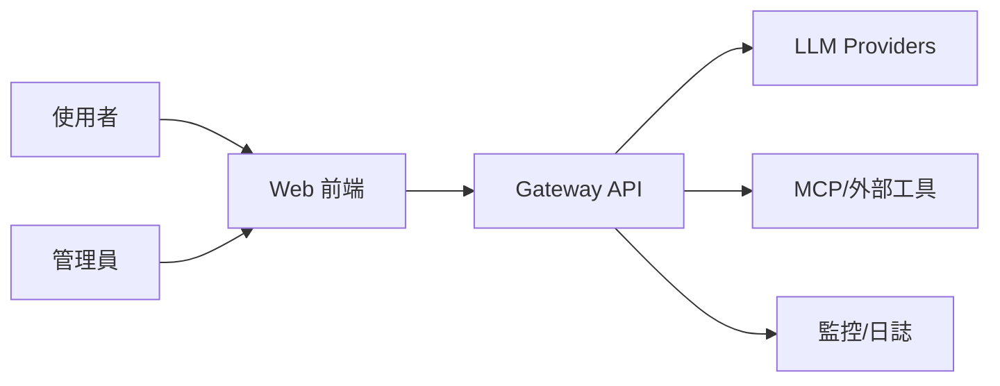
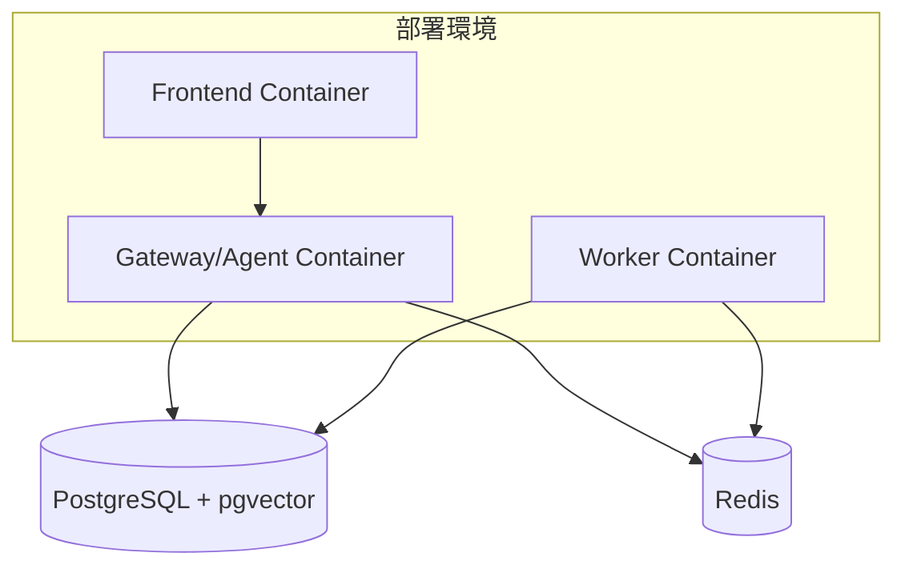
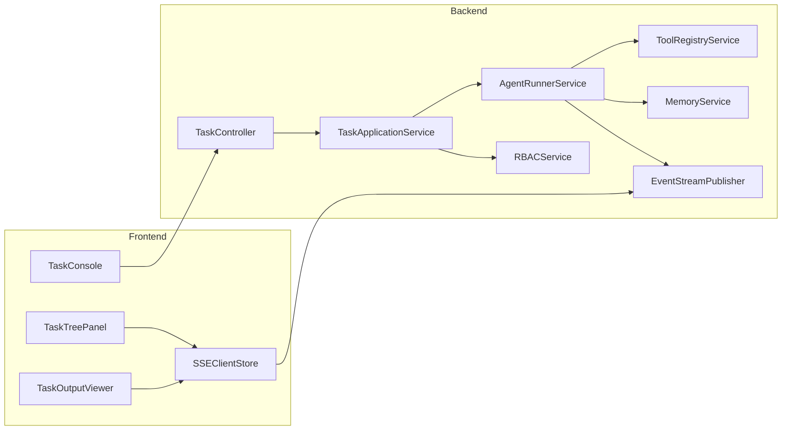
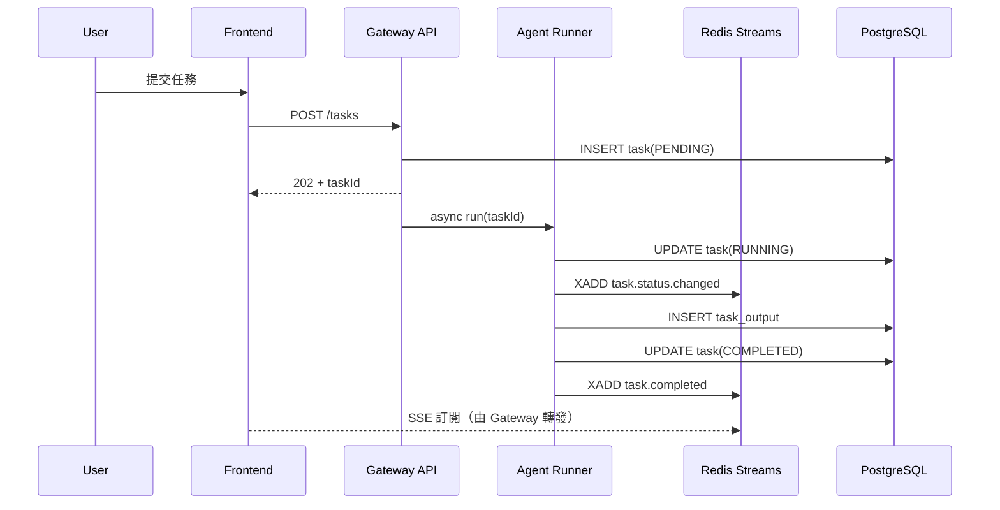
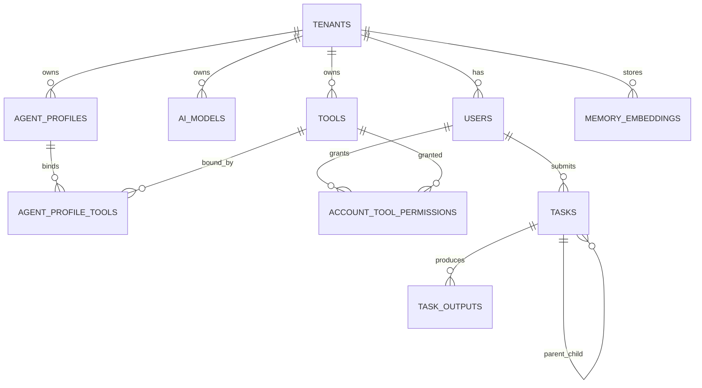
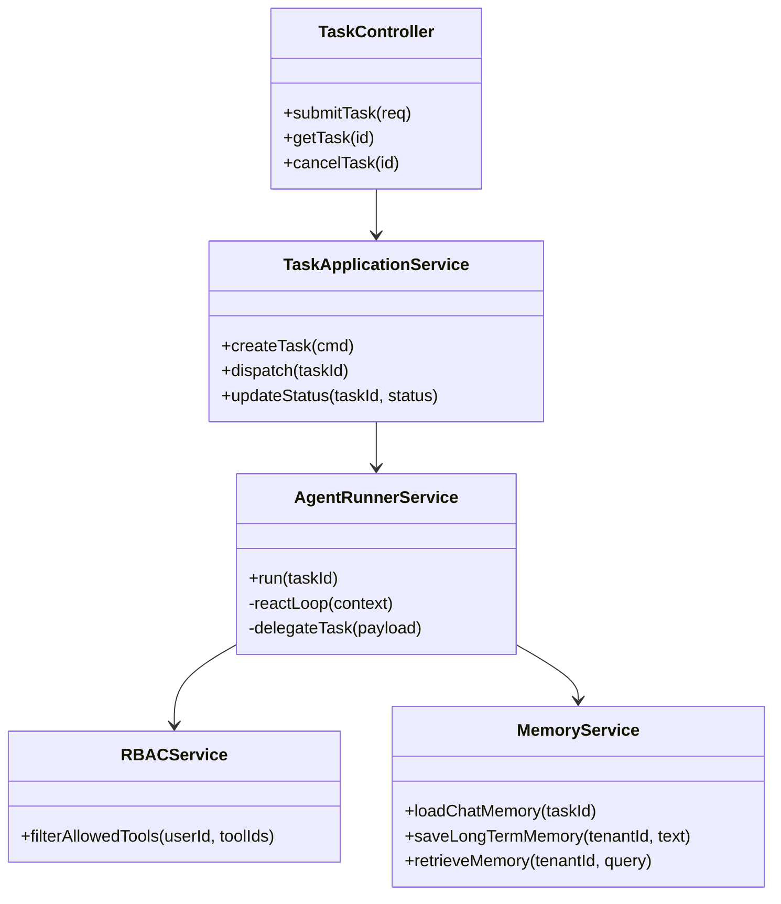
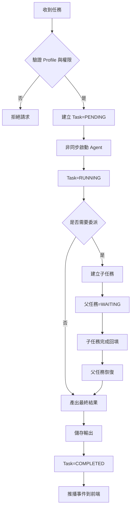
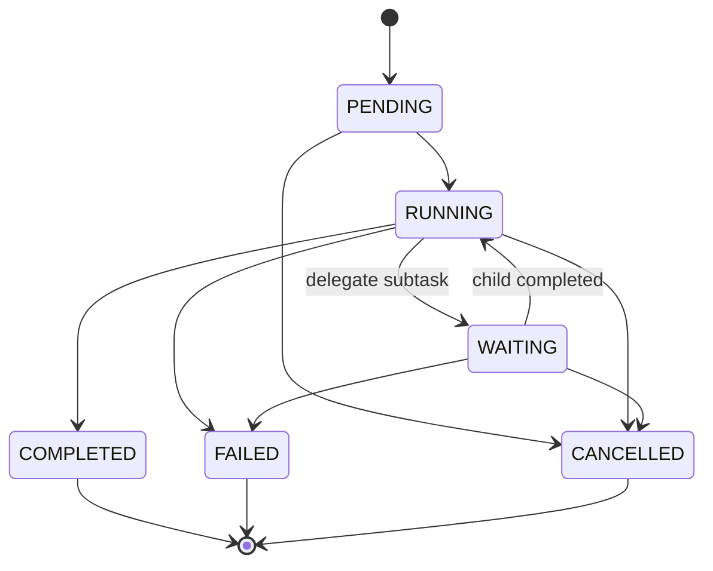

# TeamWork 系統規格書（spec）

## 1. 架構與選型
- 後端：Spring Boot 4.x (4.0.3) + Java 21（Virtual Threads）
- AI：Spring AI 2.0.0-M2（多模型抽象、Tool Calling）
- 資料庫：PostgreSQL（交易資料）+ pgvector（長期記憶）
- 快取/事件：Redis（Chat Memory、Redis Streams）
- 前端：React + TypeScript + Tailwind + React Flow
- 目標：多租戶、多 Agent 協作、可觀測、可擴充

選型理由：
- PostgreSQL + pgvector 可同時支撐結構化狀態與語意檢索
- Redis Streams 支援事件可回放，避免 Pub/Sub 遺失問題
- Spring AI 可抽象不同 LLM provider，降低供應商耦合

## 2. 資料模型
核心實體：
- `tenants`：租戶
- `users`：使用者
- `ai_models`：模型註冊
- `tools`：工具註冊
- `agent_profiles`：Agent 設定檔
- `agent_profile_tools`：Profile 與 Tool 關聯
- `account_tool_permissions`：使用者/租戶工具授權
- `tasks`：任務主體（含父子任務）
- `task_outputs`：任務輸出
- `memory_embeddings`：長期記憶向量
- `events_outbox`：事件外送佇列（可選，強化可靠性）

`users` 實體規劃（Phase 1 新增）：
- 欄位：`id`、`tenant_id`、`username`、`display_name`、`status`、`created_at`、`updated_at`
- 約束：`tenant_id + username` 唯一、`status` 僅允許 `ACTIVE`/`DISABLED`
- 用途：作為 Gateway 任務建立流程的使用者存在性驗證來源
- 邊界：僅保存使用者投影資料，不保存密碼雜湊、MFA secret、OAuth refresh token

狀態機（`tasks.status`）：
- `PENDING`、`RUNNING`、`WAITING`、`COMPLETED`、`FAILED`、`CANCELLED`

## 3. 關鍵流程
1. 使用者送出任務（`POST /api/v1/tasks`）
2. Gateway 驗證租戶/使用者/Agent Profile
3. 建立 `tasks`（`PENDING`）並派發到 Agent Runner
4. Agent 執行 ReAct，讀寫 Redis Chat Memory
5. 若委派子任務，建立子 `tasks`，父任務轉 `WAITING`
6. 任務完成後寫入 `task_outputs`，發布事件到 Redis Streams
7. SSE 推播任務狀態與輸出摘要給前端

Task 建立請求驗證規則：
- `userId` 必填
- `profileId` 必填
- `inputPayload` 必填
- `userId` 必須存在於 `users` 且 `status=ACTIVE`
- 身分來源策略：`dev/test` 允許 request body `userId`；`prod` 禁用 request body `userId`，需改由 Token claims 提供
- 測試預設種子使用者：`u_alice`、`u_bob`

## 4. 虛擬碼
```text
function submitTask(request, user):
  assert authorized(user, request.profileId)
  profile = loadProfile(request.profileId, user.tenantId)
  model = loadModel(profile.defaultModelId, user.tenantId)
  tools = filterToolsByRBAC(profile.tools, user)

  task = createTask(
    tenantId=user.tenantId,
    userId=user.userId,
    parentTaskId=request.parentTaskId,
    status=PENDING,
    input=request.inputPayload
  )

  dispatchAsync(task.id, profile, model, tools)
  return { taskId: task.id, status: PENDING }

function runTask(taskId):
  updateTaskStatus(taskId, RUNNING)
  context = memory.load(taskId)
  result = reactLoop(taskId, context)

  if result.needDelegate:
    child = createChildTask(taskId, result.delegatePayload)
    updateTaskStatus(taskId, WAITING)
    waitChildAndResume(taskId, child.id)

  saveOutput(taskId, result.output)
  publishStreamEvent(taskId, COMPLETED)
  updateTaskStatus(taskId, COMPLETED)
```

## 5. 系統脈絡圖


## 6. 容器/部署概觀


## 7. 模組關係圖（Backend / Frontend）


## 8. 序列圖


## 9. ER 圖


## 10. 類別圖（後端關鍵類別）


## 11. 流程圖


## 12. 狀態圖


## 補充決策
- 事件通道統一：內部事件以 Redis Streams 為主；前端推播先以 SSE 為主（保留 WebSocket 擴充點）
- 多租戶隔離：所有核心資料表與 Redis Key 必含 `tenant_id`
- `InstallSkill` 先採人工審核上架，MVP 不做完全自動安裝
- 測試資料庫策略：`gateway` 整合測試直連 `docker-compose` 啟動之 PostgreSQL（`localhost:15432`），不依賴 Testcontainers
- AI 版本基線：`gateway` 採 Spring AI `2.0.0-M2`（對齊 Spring Boot 4.0.x）
- Agent Utils 基線：引入 `org.springaicommunity:spring-ai-agent-utils:0.4.2`，作為下一階段 Sub Agent 能力開發基礎
- AI 配置策略：改用 `spring-ai-openai` library（不使用 starter 自動配置），模型/端點/API Key 由資料庫動態決定
- Agent 工具策略：`MasterAgent` 透過 Spring AI `ChatClient.tools(...)` 掛載本地工具，工具方法以 `@Tool` 定義，並沿用 taskId 作為對話上下文鍵
- 動態工具策略：新增 `DynamicToolRegistry`，以 `tool_configs`（`type=BUILT_IN`）作為開關來源，並以記憶體快取降低每次任務讀 DB 成本；`MasterAgent` 每次任務執行前都從 registry 取得當下可用工具
- 預設模型初始化：啟動時讀取專案 `.env`（`MODEL`、`BASE_URL`、`API_KEY`）並寫入 `ai_models`，同時將該模型設為預設啟用
- Sub Agent 策略（MVP）：參考 `spring-ai-agent-utils` GitHub 範例，使用 `TaskToolCallbackProvider` 掛入委派工具，先以本地 markdown 子代理定義檔（`SubagentReference`）提供最小委派能力
- Sub Agent 路由策略（Next）：Master 在每次任務中讀取可用 sub-agent 的 `name/description/tools`，由模型自主選擇最適合的 sub-agent 執行；每個 sub-agent 使用獨立 conversation key（例如 `taskId:agentName`）避免上下文互汙
- 統一 Agent 介面策略：新增 `UnifiedAgentProvider` 抽象，`MasterAgent` 僅依介面呼叫；本地 Spring AI Agent 與 Claude Agent SDK 皆透過 provider adapter 併入，降低來源耦合
- 後續整合基線（指定專案）：
  - Sandbox：`spring-ai-community/agent-sandbox`（https://github.com/spring-ai-community/agent-sandbox）
  - 外部 Agent Client：`spring-ai-community/agent-client`（https://github.com/spring-ai-community/agent-client）
  - Agent 工具與調用：`spring-ai-community/spring-ai-agent-utils`（https://github.com/spring-ai-community/spring-ai-agent-utils）
  - 工具調用參考範例：`spring-ai-agent-utils/examples`（https://github.com/spring-ai-community/spring-ai-agent-utils/tree/main/examples）
  - 原則：已完成能力（例如統一 Agent 介面、既有 tool-calling）不重複實作，只補缺口整合
- 文件同步狀態：已於 2026-02-21 依最新整合基線重整 `docs/RoadMap.md`，並完成 development 文件對齊
- User 邊界決策（MVP）：`users` 置於 Gateway 架構內，作為授權與任務路由用的本地投影；登入與憑證簽發由外部 IdP/認證系統負責
- 測試覆蓋率門檻（Phase 1 驗收）：JaCoCo `LINE >= 80%`、`BRANCH >= 60%`，未達標視為驗收未完成
